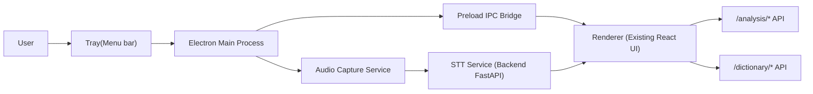

# macOS デスクトップ版（TalkScope / LexiFlow）設計書

## 1. 目的

本ドキュメントは、既存 WebApp を macOS デスクトップ版として提供するための実装設計です。  
次の要求を満たすことを目的とします。

- マイク入力だけでなく、Zoom などの相手音声（システム出力）も文字起こし対象にする
- メニューバー常駐で、すぐ起動・停止できる操作性を提供する
- 既存 Frontend（React）と Backend（FastAPI）資産を最大限再利用する

## 2. スコープ

### 2.1 MVP で実現すること

- macOS アプリとして起動できる
- メニューバー常駐（Tray）できる
- 音声入力ソースを選択できる（`Microphone` / `System Audio`）
- 音声を一定間隔で文字起こしし、既存 UI に反映できる
- 既存 API（analysis / dictionary）と連携できる

### 2.2 MVP で実施しないこと

- Windows/Linux 対応
- 高度な話者分離（Diarization）
- 完全オフライン配布最適化（モデル同梱の大規模最適化）

## 3. 技術選定

## 3.1 候補比較

| 候補 | 既存 React 再利用 | メニューバー常駐 | システム音声対応 | 実装速度 | 総評 |
| --- | --- | --- | --- | --- | --- |
| Electron | 高い | 容易 | 実現しやすい | 速い | **採用** |
| Tauri 2 | 高い | 容易 | 可能だがネイティブ実装比率高め | 中 | 将来候補 |
| React Native macOS | 中 | 可能 | 可能だが AppKit 実装依存が高い | 遅い | 今回は非採用 |

## 3.2 採用方針

MVP は **Electron** を採用します。主な理由は以下です。

- 既存 Frontend を最小変更で流用できる
- Tray と自動起動が標準 API で実装できる
- プロトタイピング速度が高く、ハッカソン開発に適合する

## 4. 全体アーキテクチャ



## 4.1 コンポーネント責務

- `Electron Main Process`
  - Tray 作成、起動/停止、ウィンドウ制御、権限チェック
- `Preload`
  - Renderer に公開する最小限 API（IPC 経由）
- `Renderer (React)`
  - 既存 UI 表示、文字起こし結果表示、用語抽出表示
- `Audio Capture Service`
  - 入力ソースごとの録音、PCM 変換、チャンク送信
- `Backend STT Service`
  - 音声チャンクを文字起こしして返す

## 5. 音声処理設計

## 5.1 入力ソース

- `Microphone`: 端末マイク
- `System Audio`: Zoom/Meet などの相手音声を含むシステム出力

## 5.2 キャプチャ方式

- Electron 側で音声ストリームを取得
- 16kHz / mono / PCM に正規化
- 2〜5 秒ごとにチャンク化して STT へ送信

## 5.3 文字起こし・解析方式（統合API）

Web Speech API は任意ストリーム入力を扱いづらいため、デスクトップ版では STT をバックエンド化します。

- 新規 API（MVP）: `POST /pipeline/transcribe-analyze`
- リクエスト: `audio chunk` + `session_id` + `chunk_seq` + 各種解析オプション
- レスポンス: `transcript(partial/final)` + `vectorize` + `sentence_vectorize` + `dictionary(任意)`

詳細仕様は以下を参照:

- `/Users/honmayuudai/MyHobby/hackson/KC3Hack2026/doc/frontend-api-desktop-pipeline.md`

STT エンジンは MVP では次のいずれかを採用します。

- 第一案: `faster-whisper`（Python）  
- 代替案: 外部 STT API（運用コストとレイテンシ要確認）

## 6. macOS 固有要件

## 6.1 権限

- マイク権限
- 画面収録/システム音声取得に必要な権限（OS バージョン依存）

## 6.2 配布要件

- Developer ID 署名
- notarization（公証）
- 初回起動時の権限ダイアログ導線整備

## 6.3 互換性方針

- 推奨: macOS 14 系（最新に近い環境）
- 旧 OS は制約が増えるため、必要に応じて仮想オーディオデバイス（例: BlackHole）を fallback 手段として案内

## 7. リポジトリ構成案

```txt
KC3Hack2026/
├── Frontend/                  # 既存 React UI（再利用）
├── Backend/                   # 既存 FastAPI + STT API 追加
├── Desktop/
│   ├── electron/
│   │   ├── src/main/          # tray, window, app lifecycle
│   │   ├── src/preload/       # IPC bridge
│   │   └── src/shared/        # 型・定数
│   └── README.md
└── doc/plan/
    └── macos-desktop-app-design.md
```

## 8. IPC/API 設計（MVP）

## 8.1 IPC（Main ←→ Renderer）

- `desktop:getAudioSources`
- `desktop:startCapture`
- `desktop:stopCapture`
- `desktop:getPermissions`
- `desktop:openSettings`

## 8.2 Backend API（追加）

- `POST /pipeline/transcribe-analyze`
  - 入力: `session_id`, `chunk_seq`, `audio`, `include_dictionary`, `normalize_sentence_vector` など
  - 出力: `transcript`, `analysis(vectorize/sentence_vectorize)`, `dictionary`

## 9. 1週間 MVP 実装計画

## Day 1: Desktop 土台

- `Desktop/electron` 初期化
- Frontend 表示（dev/prod 両モード）
- Tray アイコン、メニュー、Window 表示/非表示

## Day 2: 音声入力 PoC

- マイク入力キャプチャ
- システム音声入力キャプチャ PoC
- 権限ダイアログ導線の確認

## Day 3: STT API 実装

- `Backend` に `/pipeline/transcribe-analyze` 追加
- チャンク受信、文字起こし、解析統合の最小実装
- API 単体テスト追加

## Day 4: E2E 接続

- Desktop から STT API 接続
- partial/final テキスト反映
- 既存の用語抽出/バブル UI 連携確認

## Day 5: UX 仕上げ

- メニューバー操作（開始/停止/入力切替）
- 自動起動設定
- エラーハンドリング（権限不足/ネットワーク/タイムアウト）

## Day 6: 品質確認

- 手動テストシナリオ実施
- ログ整備、クラッシュ時復旧確認
- 主要 README 更新

## Day 7: 配布準備

- macOS 署名/公証手順確定
- `.app` 配布手順と既知制約を文書化

## 10. リスクと対策

- システム音声取得が OS バージョン差で不安定  
  対策: 推奨 OS を固定し、fallback（仮想オーディオ）を用意する

- 文字起こし遅延が大きい  
  対策: チャンク長調整（2〜5秒）、モデル軽量化、非同期キュー導入

- 権限拒否で機能停止  
  対策: 初回セットアップ導線と再許可手順を UI に組み込む

## 11. 受け入れ基準（MVP 完了条件）

- Tray から録音開始/停止ができる
- `Microphone` と `System Audio` の両方で文字起こし表示できる
- 文字起こし結果が既存 Frontend の分析導線に接続される
- 10 分連続動作でクラッシュしない
- 主要エラーでユーザーが復帰手順を把握できる

## 12. 次フェーズ（MVP 後）

- Tauri 移行の再評価（バイナリ軽量化目的）
- オフライン STT モデル同梱と差分更新
- 要約、話者分離、会話区間検出の高度化
