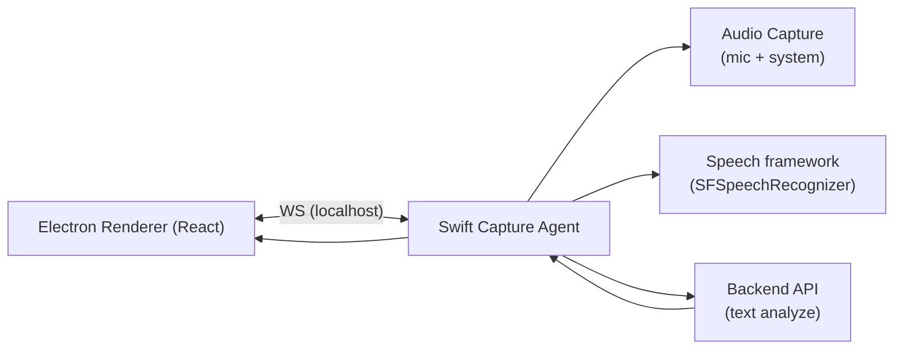

# Swift Capture Agent + localhost WebSocket 設計書

## 1. 目的

本ドキュメントは、既存 Electron/React UI を維持しつつ、macOS 音声取得と文字起こしを Swift 補助アプリへ分離する設計を定義する。

狙い:

- マイク音声・システム音声を同時に扱う
- 文字起こしは macOS ネイティブ（Speech framework）で実行する
- UI とは localhost WebSocket で接続する
- Backend は「解析専用API」として利用する

## 2. 非機能要件

- 低遅延: partial は 300ms 〜 1s 以内で UI 反映
- 安定性: 10分以上の連続動作でクラッシュしない
- 回復性: Agent 再起動時に UI が自動再接続できる
- 監査性: 主要イベントを構造化ログで出力

## 3. 全体構成



## 4. コンポーネント責務

### 4.1 Swift Capture Agent

- MenuBar 常駐、起動時常駐
- 入力ソース制御（`microphone` / `system_audio` / 同時）
- 文字起こし（partial/final）
- final テキストを Backend に送信して解析結果を取得
- UI へ transcript/analysis/error/state を WS で配信

### 4.2 Electron Renderer

- 操作UI（開始/停止/ソース切替）
- WebSocket 接続管理と再接続
- transcript/bubble/history 表示
- Agent エラーのユーザー誘導表示

### 4.3 Backend

- 解析処理（形態素解析、ベクトル化、辞書）
- 入力は最終的にテキスト（音声非依存）

## 5. 推奨API再定義（Backend）

Swift 側で STT 済みのため、Desktop 経路では以下のテキスト解析APIを推奨する。

- `POST /pipeline/analyze-text`
  - 入力: `session_id`, `source`, `utterance_id`, `seq`, `text`, `is_final`, `start_ms`, `end_ms`, 各解析オプション
  - 出力: `analysis.vectorize`, `analysis.sentence_vectorize`, `dictionary`

注:
- 既存 `/pipeline/transcribe-analyze` の `text_override` でも暫定運用は可能。
- ただし長期運用は `analyze-text` 分離を推奨する。

## 6. WebSocket 通信仕様

### 6.1 エンドポイント

- URL: `ws://127.0.0.1:55100/ws`
- サブプロトコル: `lexiflow.capture.v1`

### 6.2 メッセージ共通Envelope

```json
{
  "version": "1.0.0",
  "kind": "command",
  "name": "start_capture",
  "request_id": "0f66b3b0-3f3e-4d47-9a7c-4b8e3b3f13da",
  "timestamp_ms": 1764000000123,
  "payload": {}
}
```

必須フィールド:

- `version`: プロトコルバージョン
- `kind`: `command` / `event` / `response`
- `name`: メッセージ種別名
- `timestamp_ms`: エポックミリ秒
- `payload`: 本体

`request_id` は `command` と `response` で必須（`event` では任意）。

### 6.3 command 一覧（UI -> Agent）

- `hello`
- `get_status`
- `start_capture`
  - `system_audio` 利用時は任意で `source_id` を渡し、対象の画面/ウィンドウ選択に利用できる
- `stop_capture`
- `set_source_enabled`
- `open_settings`
- `set_auto_launch`

### 6.4 event 一覧（Agent -> UI）

- `ready`
- `state_changed`
- `partial_transcript`
- `final_transcript`
- `analysis_result`
- `permission_required`
- `error`
- `capture_stopped`

### 6.5 response

- `ok`: `true/false`
- `error`: `ok=false` 時のみ返す
- `payload`: command ごとの戻り値

## 7. セッション/順序管理

- `session_id`: 1録音セッションを識別
- `source`: `microphone` or `system_audio`
- `utterance_id`: 発話単位ID
- `seq`: source 単位の単調増加連番

順序ルール:

- 同一 `source` では `seq` が単調増加
- `partial_transcript` は同一 `utterance_id` に対して上書き可能
- `final_transcript` 受信後は当該 `utterance_id` の partial を破棄

## 8. エラーコード規約

- `PERMISSION_DENIED_MICROPHONE`
- `PERMISSION_DENIED_SCREEN`
- `PERMISSION_DENIED_SPEECH`
- `SYSTEM_AUDIO_NOT_SUPPORTED`
- `CAPTURE_START_FAILED`
- `STT_NOT_AVAILABLE`
- `BACKEND_TIMEOUT`
- `BACKEND_UNAVAILABLE`
- `INTERNAL_ERROR`

## 9. JSON Schema

正式スキーマは以下ファイルを参照する。

- WS メッセージ: `/Users/honmayuudai/MyHobby/hackson/KC3Hack2026/doc/plan/schemas/swift-agent-ws-message.schema.json`
- Agent -> Backend リクエスト: `/Users/honmayuudai/MyHobby/hackson/KC3Hack2026/doc/plan/schemas/swift-agent-backend-analyze-request.schema.json`

## 10. 実装フェーズ

### Phase 1

- Swift Agent 雛形（WS + mic STT）
- UI 接続（start/stop/state）

### Phase 2

- system_audio 追加
- Backend analyze-text 連携

### Phase 3

- 自動起動・復旧・ロギング強化
- インストーラ/配布導線整備
